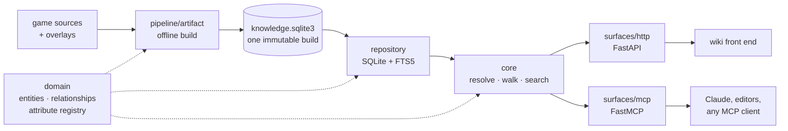

> This project is a WIP, please wait for official release

# 2009scape-wiki-api

Turns the raw 2009scape game sources (items, NPCs, shops, drop tables, quests,
locations) into one immutable, searchable knowledge base, and serves it two ways:

- an **HTTP JSON API** for a separate wiki front end
- an **MCP server**, so Claude and other agents can answer questions about the game

## How it fits together



The build is offline and always from source. The dataset is
published to Hugging Face and downloaded at runtime, so it is not committed here.

Prebuild docker container containing the mcp server, fast api or both will be uploaded to docker hub in the future. 

Both surfaces call the same `core`, so a lookup is never written twice. `domain`
declares what an attribute means and how it presents, which is why a payload can be
rendered without any client knowing field names.

## What comes back

An agent asks in a player's words and gets a compact answer:

```jsonc
// dropped_by("dragon scimitar")
{"outcome": "found",
 "result": {"of": "Dragon scimitar", "label": "Dropped by", "total": 1,
            "neighbours": [{"name": "King Black Dragon", "type": "npc", "id": 50,
                            "facts": {"Chance": "1/512"}}]}}
```

The HTTP surface answers the same question with everything a renderer needs where each
value carries its own label, group, format and unit:

```jsonc
// GET /v1/entities/npc/50/rel/drops?limit=2
{"walk": {"origin": {"type": "npc", "id": 50}, "rel": "drops", "direction": "forward"},
 "label": "Drops",
 "rows": {"items": [{"link": {"type": "item", "id": 536, "slug": "dragon-bones",
                              "label": "Dragon bones"},
                     "attributes": [{"key": "chance", "value": 0.5, "label": "Chance",
                                     "format": "rate", "derived": true},
                                    {"key": "weight", "value": 100.0, "label": "Weight"}]}],
          "total": 3, "limit": 2, "next_offset": 2}}
```

`GET /v1/entities/item/dragon-scimitar` returns the whole page with infobox, sections and
a first page of every relationship in one response. Full contract at `/docs`.

## Project layout

| path | what lives there |
| --- | --- |
| `src/wiki_api/domain` | entities, relationships, the attribute registry |
| `src/wiki_api/pipeline` | the offline build that writes the artifact |
| `src/wiki_api/repository` | data access behind one protocol (SQLite/FTS5, in-memory) |
| `src/wiki_api/core` | the query logic both surfaces share |
| `src/wiki_api/surfaces/http` | the FastAPI contract |
| `src/wiki_api/surfaces/mcp` | the MCP server |
| `tests` | integration tests and hand-made knowledge fixtures |
| `demos` | worked examples, one folder each, run with `uv run poe demo <folder>` |

## Running it

Requires [uv](https://docs.astral.sh/uv/), which installs the pinned Python for you.

```bash
uv sync --all-extras
uv run poe build-artifact   # both surfaces refuse to start without a dataset
uv run poe serve            # HTTP API on :8000, docs at /docs
uv run poe mcp              # MCP server over stdio (http comming)
uv run poe check            # lint, types, import boundaries, tests
uv run poe fix              # auto-fix formatting and simple lint issues
```

### Pointing an agent at it

This repository carries a `.mcp.json`, so running `claude` here offers the server and
asks you to approve it once. Any other MCP client can spawn the console script:

```json
{"mcpServers": {"2009scape-wiki": {"type": "stdio", "command": "uv",
  "args": ["run", "--directory", "/path/to/2009scape-wiki-api", "--quiet",
           "scape2009-wiki-mcp"]}}}
```

For a container or shared host, serve it over HTTP instead, currently there is no
authentication, but this will be implemneted in the future:

```bash
WIKI_API_MCP_TRANSPORT=http WIKI_API_MCP_PORT=8009 uv run poe mcp
```

