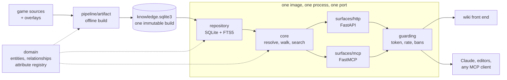

# 2009scape-wiki-api

[](https://pypi.org/project/scape2009-wiki-api/)
[](https://pypistats.org/packages/scape2009-wiki-api)
[](https://pypi.org/project/scape2009-wiki-api/)
[](https://hub.docker.com/r/arsalananwari/2009scape-wiki-api)
[](https://hub.docker.com/r/arsalananwari/2009scape-wiki-api)
[](https://github.com/arsalan-anwari/2009scape-wiki-api/actions/workflows/ci.yml)

[](https://github.com/arsalan-anwari/2009scape-wiki-api/releases/latest)
[](https://github.com/arsalan-anwari/2009scape-wiki-api/releases/latest)
[](https://github.com/arsalan-anwari/2009scape-wiki-api/releases/latest)
[](https://huggingface.co/datasets/arsalan-anwari/2009scape-wiki-api-data)
[](https://arsalan-anwari.github.io/2009scape-wiki-api/)
[](docs/http-api.rst)
[](docs/mcp.rst)
[](LICENSE)

Turns the raw 2009scape game sources (items, NPCs, shops, drop tables, quests, locations)
into one immutable SQLite artifact, served two ways: a **FastAPI** contract for a wiki
front end, and an **MCP server** for Claude and other agents.



A build holds ~20,000 entities, ~83,000 relationships and two years of weekly Grand
Exchange prices. It ships on
[Hugging Face](https://huggingface.co/datasets/arsalan-anwari/2009scape-wiki-api-data),
never in this repository.

## Installing

```bash
uv tool install scape2009-wiki-api                        # a Python environment
docker run -p 8000:8000 arsalananwari/2009scape-wiki-api  # a container
```

Debian, Fedora and Arch packages are on the
[releases page](https://github.com/arsalan-anwari/2009scape-wiki-api/releases); they carry
the dataset, so an offline machine answers everything. See [install](docs/install.rst).

## Getting started

Requires [uv](https://docs.astral.sh/uv/).

```bash
uv sync --all-extras
uv run poe download-data          # the published dataset into data/
uv run poe keys init              # the key this deployment answers, once
uv run poe keys issue --label me  # one token, saved under tokens/me.json
uv run poe serve                  # HTTP on :8000, contract at /docs

TOKEN=$(jq -r .access_token ~/.config/scape2009-wiki-api/tokens/me.json)
curl -H "authorization: Bearer $TOKEN" \
  http://localhost:8000/v1/entities/item/dragon-scimitar
```

Both surfaces refuse to start without a dataset and an issuer key, naming which is
missing. `WIKI_API_AUTH_MODE=off` answers everyone instead.

This repository carries a `.mcp.json`, so running `claude` here offers the MCP server.

## Documentation

`uv run poe docs` builds the full documentation into `docs/out`, or read the sources:

| read | for |
| --- | --- |
| [install](docs/install.rst), [getting started](docs/getting-started.rst) | packages, containers, first questions |
| [configuration](docs/configuration.rst), [access](docs/access.rst) | settings, `deploy.json`, keys, tokens, bans |
| [http-api](docs/http-api.rst), [mcp](docs/mcp.rst), [demos](docs/demos.rst) | the two surfaces, and worked examples |
| [architecture](docs/architecture.rst), [data model](docs/data-model.rst), [pipeline](docs/pipeline.rst) | layers, entities, how a build is made |
| [extending](docs/extending.rst), [contributing](docs/contributing.rst) | adding a sort, a relationship, a release |

Versions are decided in [`CHANGELOG.md`](CHANGELOG.md) alone; see
[contributing](docs/contributing.rst) for how a release is cut.
