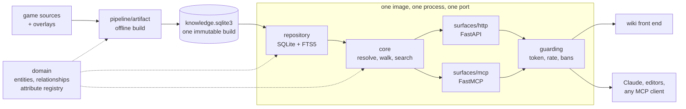

> This project is a WIP, please wait for official release

# 2009scape-wiki-api

Turns the raw 2009scape game sources (items, NPCs, shops, drop tables, quests,
locations) into one immutable SQLite artifact, and serves it two ways: a **FastAPI**
contract for a wiki front end, and an **MCP server** so Claude and other agents can
answer questions about the game.



The build is offline and always from source. The dataset ships on
[Hugging Face](https://huggingface.co/datasets/arsalan-anwari/2009scape-wiki-api-data)
and is fetched before a server starts, never committed here. A build holds about 20,000
entities, 83,000 relationships between them, and two years of weekly Grand Exchange
prices.

## Getting started

Requires [uv](https://docs.astral.sh/uv/), which installs the pinned Python for you.

```bash
uv sync --all-extras
uv run poe download-data          # the published dataset into data/
uv run poe keys init              # the key this deployment answers, once
uv run poe keys issue --label me  # one token, saved under tokens/me.json
uv run poe serve                  # HTTP on :8000, contract at /docs
```

Then ask it something:

```bash
TOKEN=$(jq -r .access_token ~/.config/scape2009-wiki-api/tokens/me.json)
curl -H "authorization: Bearer $TOKEN" \
  http://localhost:8000/v1/entities/item/dragon-scimitar
```

Two things must be in place before either surface starts: a dataset, and a key to check
tokens against. Both stop with a message saying which is missing. Set
`WIKI_API_AUTH_MODE=off` to answer everyone instead.

## What the answers look like

An agent asks in a player's words and gets a compact answer:

```jsonc
// dropped_by("dragon scimitar")
{"outcome": "found",
 "result": {"of": "Dragon scimitar", "label": "Dropped by", "total": 1,
            "neighbours": [{"name": "King Black Dragon", "type": "npc", "id": 50,
                            "facts": {"Chance": "1/512"}}]}}
```

HTTP answers the same question with everything a renderer needs, each value carrying its
own label, format and unit:

```jsonc
// GET /v1/entities/npc/50/rel/drops?limit=1
{"walk": {"origin": {"type": "npc", "id": 50}, "rel": "drops", "direction": "forward"},
 "label": "Drops",
 "rows": {"items": [{"link": {"type": "item", "id": 536, "slug": "dragon-bones",
                              "label": "Dragon bones"},
                     "attributes": [{"key": "chance", "value": 0.5, "label": "Chance",
                                     "format": "rate", "derived": true}]}],
          "total": 3, "limit": 1, "next_offset": 1}}
```

`GET /v1/entities/item/dragon-scimitar` returns the whole page in one response: infobox,
sections, and a first page of every relationship.

What a thing is worth comes back two ways. The page and the hover card carry a summary of
it, and every value says how far to trust itself: an item whose recorded worth never moved
in two years reads `static`, one that never left the floor reads `untraded` and carries no
price at all, and only one that actually traded reads `traded`. The whole record is a
resource of its own, so a chart is one request and no page pays for it:

```jsonc
// GET /v1/entities/item/dragon-scimitar/prices?since=2026-01-01&limit=2
{"items": [{"item_id": 4587, "snapshot_date": "2026-07-18", "value": 108601},
           {"item_id": 4587, "snapshot_date": "2026-07-25", "value": 108590}],
 "total": 2, "limit": 2, "offset": 0}
```

Anything the market never recorded answers with an empty page rather than a refusal.

Not every question starts from a name. A question whose subject is a number is asked
against a whole type, and the words for the value come from the registry rather than from
the caller's imagination: pass the key `GET /v1/types` publishes, or the label beside it.

```jsonc
// GET /v1/types/item/compare?holds=Strength%20bonus&how=more_than&number=100&descending=true
{"type": "item",
 "where": [{"path": "bonuses.strength", "compare": "more_than", "value": 100.0}],
 "order": {"path": "bonuses.strength", "descending": true},
 "rows": {"items": [{"link": {"type": "item", "id": 11694, "slug": "armadyl-godsword",
                              "label": "Armadyl godsword"},
                     "attributes": [{"key": "bonuses.strength", "value": 132,
                                     "label": "Strength bonus", "format": "int"}]}],
          "total": 18, "limit": 50, "offset": 0}}
```

Anything not carrying the value being compared or sorted on is left out of the answer and
out of the total, because it is absent rather than smallest. Words no declared value
answers to are a 422 rather than a best guess.

A name that answers to nothing is never silently corrected. The refusal says where to
ask what it might have meant, and that answer carries names only:

```jsonc
// GET /v1/near-names?name=dragon%20scimtar&type=item
{"items": [{"link": {"type": "item", "id": 4587, "slug": "dragon-scimitar",
                     "label": "Dragon scimitar"},
            "type": "item", "description": null, "score": 0.966}],
 "total": 1, "limit": 5, "offset": 0}
```

The type is required, because `dagon` is a near miss for different things depending on
whether an item or an npc was meant. Nothing close enough comes back empty rather than
as the least bad guess. `WIKI_API_NEAR_FLOOR` sets that floor.

## Keys

Make the issuer key on your own machine and hand out tokens signed by it. Only the
public half reaches a server, so nothing in a container can mint a key.

```bash
uv run poe keys init                        # prints WIKI_API_AUTH_PUBLIC_KEY=...
uv run poe keys issue --label the-wiki      # one token, kept in tokens/the-wiki
uv run poe keys revoke --kid <key id>       # stop answering that one
uv run poe keys show                        # the public key, and what is withdrawn
uv run poe keys banned                      # which addresses are being refused
uv run poe keys unban --caller 1.2.3.4      # answer one of them again
```

Three files come out, and they go to three different places:

| file | belongs to | goes |
| --- | --- | --- |
| `issuer.key` | you | nowhere else, ever. Not the image, not the volume |
| `issuer.pub` | the service | `/config`, the only thing a container needs |
| `tokens/<label>.json` | whoever calls the service | the caller, never the container |

They live in `~/.config/scape2009-wiki-api` unless `WIKI_API_CONFIG_DIR` or
`XDG_CONFIG_HOME` says otherwise. A service started on that machine finds the key by
itself. Elsewhere, hand it the public half and nothing more:

```bash
WIKI_API_AUTH_PUBLIC_KEY='...' \
WIKI_API_CORS_ORIGINS='["https://wiki.example.test"]' \
uv run poe serve
```

Before relying on it:

- Tokens never expire. A leaked one is answered until it is withdrawn by key id, or
  until the issuer key is replaced, which refuses every token at once.
- Repeated refusals shut an address out, for longer each time. A real key asking too
  fast is throttled with a `Retry-After` instead.
- Who is shut out is written to `banned.json` beside the keys, so that directory must be
  writable while the guard is on.
- A caller's share is counted per process, not written down. Two replicas mean two
  shares. Put a rate limiter in front if that matters.
- `/health` is the only path answered without a token.
- A client that started the server itself is never challenged. Over stdio there is
  nobody to keep out, so a key is only ever asked for over http.

## MCP clients

This repository carries a `.mcp.json`, so running `claude` here offers the server and
asks you to approve it once. Any other client can spawn the console script:

```json
{"mcpServers": {"2009scape-wiki": {"type": "stdio", "command": "uv",
  "args": ["run", "--directory", "/path/to/2009scape-wiki-api", "--quiet",
           "scape2009-wiki-mcp"]}}}
```

For a container or a shared host, serve the tools over HTTP instead:

```bash
WIKI_API_MCP_TRANSPORT=http WIKI_API_MCP_PORT=8009 uv run poe mcp
```

## Containers

One image serves the HTTP contract, the MCP tools, or both from one process on one port.
Which of the three is a config line, overridable by an environment variable.

```bash
uv run poe container up      # build it, prepare what it needs, start it
uv run poe container check   # ask it what a deployment has to answer
uv run poe container down    # stop it and remove it
```

`up` fetches the dataset into `run/data`, copies your `issuer.pub` into `run/config`,
issues a token if you have not, and passes podman the two flags docker does not need.
Three flags change the start, and `check` asks after whichever was used:

| flag | instead of |
| --- | --- |
| `--fixture` | serve the test fixture rather than fetching the published dataset |
| `--compose` | start through `compose.yaml` rather than a plain `docker run` |
| `--open` | answer everyone rather than only key holders |

Compose is the same image reading the same two directories, for when you want it to keep
running:

```bash
uv run poe container prepare   # dataset into run/data, key into run/config
docker compose up --build      # both surfaces on :8000, tools under /mcp
```

The dataset is mounted read only at `/data`, keys and `deploy.json` at `/config`. Copy
[`deploy.example.json`](deploy.example.json) to `run/config/deploy.json` to write a
deployment down instead of passing a dozen variables. Serve an older build by naming it:
`WIKI_API_HF_REVISION=<commit> uv run poe container up`.

A running container is already an MCP server, since the tools sit at `/mcp` in the same
process behind the same token. Point Claude Code at it rather than letting it spawn one:

```bash
claude mcp add --transport http 2009scape-wiki-docker http://127.0.0.1:8000/mcp/ \
  --header "authorization: Bearer $(uv run poe container token)"
```

Registering both this and the `.mcp.json` server tells you whether a change is in the
container or in the code. A token outlives the container, so `container up` again does
not invalidate it.

## Layout

| path | what lives there |
| --- | --- |
| `src/wiki_api/domain` | entities, relationships, the attribute registry |
| `src/wiki_api/pipeline` | the offline build: staging, adapters, merge, writer |
| `src/wiki_api/repository` | data access behind one protocol (SQLite/FTS5, in-memory) |
| `src/wiki_api/core` | the query logic both surfaces share |
| `src/wiki_api/surfaces/http` | the FastAPI contract |
| `src/wiki_api/surfaces/mcp` | the MCP server |
| `src/wiki_api/access` | issued keys, and how much one caller may ask for |
| `src/wiki_api/serve.py` | starting one surface, the other, or both |
| `tests` | integration tests and hand-made knowledge fixtures |
| `demos` | worked examples, one folder each, run with `uv run poe demo <folder>` |
| `game_data` | the game's own repositories, checked out and never written to |
| `data/source` | what staging wrote: `configs`, `tables`, `cache`, `grand-exchange` and the manifest describing them, which the build reads, plus `wiki` and `places`, which only `prefill-overlays` opens |
| `overlays` | hand-written corrections, merged over the sources at build time |
| `identity` | the numbers kept for things the sources name but never number |

Each demo needs `poe keys issue --label demos` first, and its own `.env`.

## Development

```bash
uv run poe check                 # lint, types, import boundaries, tests
uv run poe check-docs            # prose gate over comments, docstrings and README
uv run poe fix                   # auto-fix formatting and simple lint issues
uv run poe build-test-artifact   # hand-made data at data/tests, enough to serve
uv run poe upload-data           # publish a build, if the dataset is yours
```

Build the artifact yourself only when changing the pipeline. The test build lands in
`data/tests` so it never overwrites what a deployment serves. Point at it with
`WIKI_API_DATA_DIR=data/tests`. The test suite mints its own key per run.

### Building from the game's own sources

Ingestion is two commands with a directory between them. Staging reads the checked-out
game repositories and writes `data/source/`; the build reads that directory and the
hand-written inputs beside it, and never opens the submodules.

```bash
uv run poe sync-submodules       # check out the game repositories under game_data/
uv run poe stage-sources         # copy, extract and fetch into data/source/
uv run poe allocate-ids --write  # number what the sources name but never number
uv run poe prefill-overlays      # write the overlays a person finishes by hand
uv run poe build-artifact        # data/source + overlays + identity -> the artifact
```

`stage-sources` takes `--only configs`, `--only tables`, `--only cache`, `--only places`
or `--only prices` when you want one of them.

```bash
uv run poe stage-sources --only cache    # decode the cache into data/source/cache/
```

Decoding is allowed to fail a little, and never quietly. `pipeline/tolerance.py` names
how many rows each cache may lose and why, a build over that ceiling stops, and the
staging report prints what each one used of what it was allowed.

Corrections live in `overlays/` and are reviewed like code, because `data/` is not in
version control. An overlay that *defines* an entity takes it away from the source
entirely, which is how a duplicate id upstream gets resolved: the build stops, and the
fix is a document. `identity/` holds the number each quest, slayer task, place and
house room keeps across rebuilds; none of them ever takes its number from an enum
ordinal.
