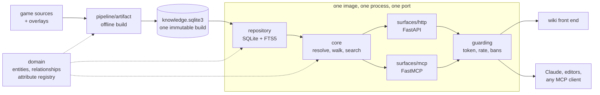

# 2009scape-wiki-api

Turns the raw 2009scape game sources (items, NPCs, shops, drop tables, quests, locations)
into one immutable SQLite artifact, served two ways: a **FastAPI** contract for a wiki
front end, and an **MCP server** for Claude and other agents.

A build holds ~20,000 entities, ~83,000 relationships and two years of weekly Grand
Exchange prices. It ships on
[Hugging Face](https://huggingface.co/datasets/arsalan-anwari/2009scape-wiki-api-data),
never in this repository.

## Installing

Debian, Fedora and Arch packages are on the
[releases page](https://github.com/arsalan-anwari/2009scape-wiki-api/releases). Each way
in is complete on its own: dataset, settings file, keys and the commands to manage them.

See [install](https://arsalan-anwari.github.io/2009scape-wiki-api/install.html). For 
install guide per method

## Documentation

The full documentation is at
[arsalan-anwari.github.io/2009scape-wiki-api](https://arsalan-anwari.github.io/2009scape-wiki-api/).

| read | for |
| --- | --- |
| [install](https://arsalan-anwari.github.io/2009scape-wiki-api/install.html), [deployment](https://arsalan-anwari.github.io/2009scape-wiki-api/deployment.html) | packages, containers, first questions |
| [configuration](https://arsalan-anwari.github.io/2009scape-wiki-api/configuration.html), [access](https://arsalan-anwari.github.io/2009scape-wiki-api/access.html) | settings, `deploy.json`, keys, tokens, bans |
| [http-api](https://arsalan-anwari.github.io/2009scape-wiki-api/http-api.html), [mcp](https://arsalan-anwari.github.io/2009scape-wiki-api/mcp.html), [demos](https://arsalan-anwari.github.io/2009scape-wiki-api/demos.html) | the two surfaces, and worked examples |
| [architecture](https://arsalan-anwari.github.io/2009scape-wiki-api/architecture.html), [data model](https://arsalan-anwari.github.io/2009scape-wiki-api/data-model.html), [pipeline](https://arsalan-anwari.github.io/2009scape-wiki-api/pipeline.html) | layers, entities, how a build is made |
| [extending](https://arsalan-anwari.github.io/2009scape-wiki-api/extending.html), [contributing](https://arsalan-anwari.github.io/2009scape-wiki-api/contributing.html) | adding a sort, a relationship, a release |

