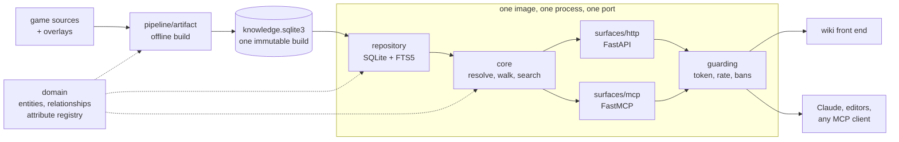

> This project is a WIP, please wait for official release

# 2009scape-wiki-api

Turns the raw 2009scape game sources (items, NPCs, shops, drop tables, quests, locations)
into one immutable SQLite artifact, and serves it two ways: a **FastAPI** contract for a
wiki front end, and an **MCP server** so Claude and other agents can answer questions
about the game.



A build holds about 20,000 entities, 83,000 relationships between them, and two years of
weekly Grand Exchange prices. The build is offline and always from source; the dataset
ships on [Hugging Face](https://huggingface.co/datasets/arsalan-anwari/2009scape-wiki-api-data)
and is fetched before a server starts, never committed here.

## Getting started

Requires [uv](https://docs.astral.sh/uv/), which installs the pinned Python for you.

```bash
uv sync --all-extras
uv run poe download-data          # the published dataset into data/
uv run poe keys init              # the key this deployment answers, once
uv run poe keys issue --label me  # one token, saved under tokens/me.json
uv run poe serve                  # HTTP on :8000, contract at /docs
```

Then ask it something:

```bash
TOKEN=$(jq -r .access_token ~/.config/scape2009-wiki-api/tokens/me.json)
curl -H "authorization: Bearer $TOKEN" \
  http://localhost:8000/v1/entities/item/dragon-scimitar
```

A dataset and an issuer key must both be in place before either surface starts, and each
stops with a message saying which is missing. Set `WIKI_API_AUTH_MODE=off` to answer
everyone instead.

## What the answers look like

An agent asks in a player's words and gets a compact answer:

```jsonc
// dropped_by("dragon scimitar")
{"outcome": "found",
 "result": {"of": "Dragon scimitar", "label": "Dropped by", "total": 1,
            "neighbours": [{"name": "King Black Dragon", "type": "npc", "id": 50,
                            "facts": {"Chance": "1/512"}}]}}
```

HTTP answers the same question with everything a renderer needs, each value carrying its
own label, format and unit:

```jsonc
// GET /v1/entities/npc/50/rel/drops?limit=1
{"walk": {"origin": {"type": "npc", "id": 50}, "rel": "drops", "direction": "forward"},
 "label": "Drops",
 "rows": {"items": [{"link": {"type": "item", "id": 536, "slug": "dragon-bones",
                              "label": "Dragon bones"},
                     "attributes": [{"key": "chance", "value": 0.5, "label": "Chance",
                                     "format": "rate", "derived": true}]}],
          "total": 3, "limit": 1, "next_offset": 1}}
```


## Keys

Make the issuer key on your own machine and hand out tokens signed by it. Only the public
half reaches a server, so nothing in a container can mint a key.

```bash
uv run poe keys init                        # prints WIKI_API_AUTH_PUBLIC_KEY=...
uv run poe keys issue --label the-wiki      # one token, kept in tokens/the-wiki
uv run poe keys revoke --kid <key id>       # stop answering that one
uv run poe keys show                        # the public key, and what is withdrawn
uv run poe keys banned                      # which addresses are being refused
uv run poe keys unban --caller 1.2.3.4      # answer one of them again
```

Three files come out, and they go to three different places:

| file | belongs to | goes |
| --- | --- | --- |
| `issuer.key` | you | nowhere else, ever. Not the image, not the volume |
| `issuer.pub` | the service | `/config`, the only thing a container needs |
| `tokens/<label>.json` | whoever calls the service | the caller, never the container |

They live in `~/.config/scape2009-wiki-api` unless `WIKI_API_CONFIG_DIR` or
`XDG_CONFIG_HOME` says otherwise, and a service started on that machine finds them itself.
Elsewhere, hand it the public half and nothing more:

```bash
WIKI_API_AUTH_PUBLIC_KEY='...' \
WIKI_API_CORS_ORIGINS='["https://wiki.example.test"]' \
uv run poe serve
```

Before relying on it:

- Tokens never expire. A leaked one is answered until it is withdrawn by key id, or until
  the issuer key is replaced, which refuses every token at once.
- Repeated refusals shut an address out, for longer each time, written to `banned.json`
  beside the keys, so that directory must be writable. A real key asking too fast gets a
  `Retry-After` instead.
- A caller's share is counted per process. Two replicas mean two shares.
- `/health` is the only path answered without a token, and a key is only ever asked for
  over http, never over stdio.

## MCP clients

This repository carries a `.mcp.json`, so running `claude` here offers the server and asks
you to approve it once. Any other client can spawn the console script:

```json
{"mcpServers": {"2009scape-wiki": {"type": "stdio", "command": "uv",
  "args": ["run", "--directory", "/path/to/2009scape-wiki-api", "--quiet",
           "scape2009-wiki-mcp"]}}}
```

For a container or a shared host, serve the tools over HTTP instead:

```bash
WIKI_API_MCP_TRANSPORT=http WIKI_API_MCP_PORT=8009 uv run poe mcp
```

## Containers

One image serves the HTTP contract, the MCP tools, or both from one process on one port.
Which of the three is a config line, overridable by an environment variable.

```bash
uv run poe container up      # build it, prepare what it needs, start it
uv run poe container check   # ask it what a deployment has to answer
uv run poe container down    # stop it and remove it
```

`up` fetches the dataset into `run/data`, copies your `issuer.pub` into `run/config`, and
issues a token if you have not. Three flags change the start, and `check` asks after
whichever was used:

| flag | instead of |
| --- | --- |
| `--fixture` | serve the test fixture rather than fetching the published dataset |
| `--compose` | start through `compose.yaml` rather than a plain `docker run` |
| `--open` | answer everyone rather than only key holders |

Compose is the same image reading the same two directories, for when you want it to keep
running:

```bash
uv run poe container prepare   # dataset into run/data, key into run/config
docker compose up --build      # both surfaces on :8000, tools under /mcp
```

The dataset is mounted read only at `/data`, keys and `deploy.json` at `/config`. Copy
[`deploy.example.json`](deploy.example.json) to `run/config/deploy.json` to write a
deployment down instead of passing a dozen variables, and name an older build with
`WIKI_API_HF_REVISION=<commit>`.

A running container is already an MCP server, with the tools at `/mcp` in the same process
behind the same token. Point Claude Code at it rather than letting it spawn one:

```bash
claude mcp add --transport http 2009scape-wiki-docker http://127.0.0.1:8000/mcp/ \
  --header "authorization: Bearer $(uv run poe container token)"
```

A token outlives the container, so `container up` again does not invalidate it.

## Layout

| path | what lives there |
| --- | --- |
| `src/wiki_api/domain` | entities, relationships, the attribute registry |
| `src/wiki_api/pipeline` | the offline build: staging, adapters, merge, writer |
| `src/wiki_api/repository` | data access behind one protocol (SQLite/FTS5, in-memory) |
| `src/wiki_api/core` | the query logic both surfaces share |
| `src/wiki_api/surfaces/http` | the FastAPI contract |
| `src/wiki_api/surfaces/mcp` | the MCP server |
| `src/wiki_api/access` | issued keys, and how much one caller may ask for |
| `src/wiki_api/serve.py` | starting one surface, the other, or both |
| `tests` | integration tests and hand-made knowledge fixtures |
| `demos` | worked examples, one folder each, run with `uv run poe demo <folder>` |
| `game_data` | the game's own repositories, checked out and never written to |
| `data/source` | what staging wrote, and what the build reads: `configs`, `tables`, `shared`, `cache`, `code`, `constants`, `music`, `grand-exchange` and the manifest describing them |
| `overlays` | hand-written corrections, merged over the sources at build time |
| `identity` | the numbers kept for things the sources name but never number |

Each demo needs its own `.env` for an Anthropic credential and a build in `data` to
answer from. None of them reaches a server: each starts `scape2009-wiki-mcp` itself and
speaks to it down a pipe, reading `data/knowledge.sqlite3` and nothing else, so there is
no port to guard and no key to issue for one.